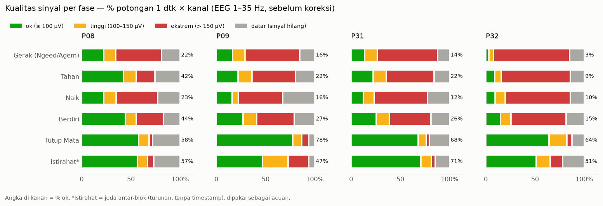
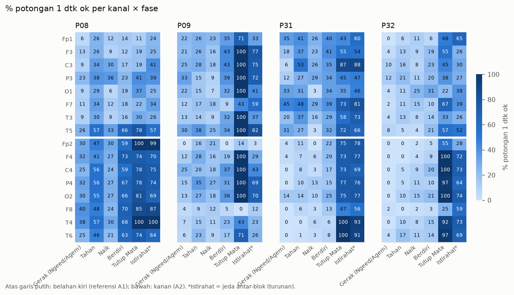
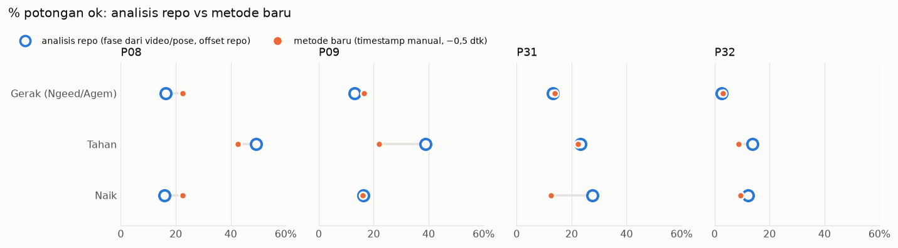
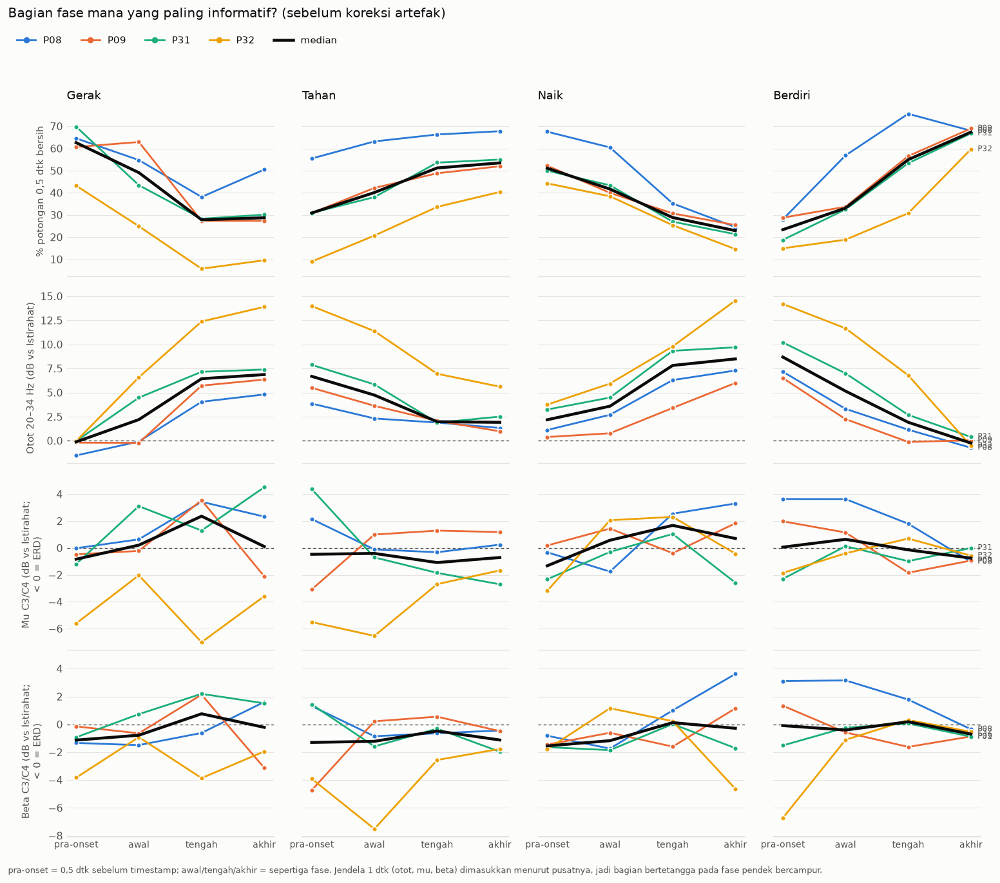
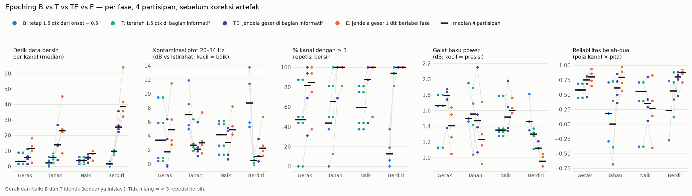
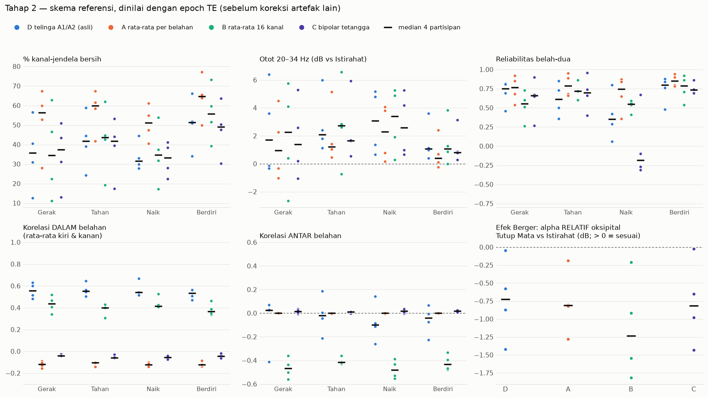
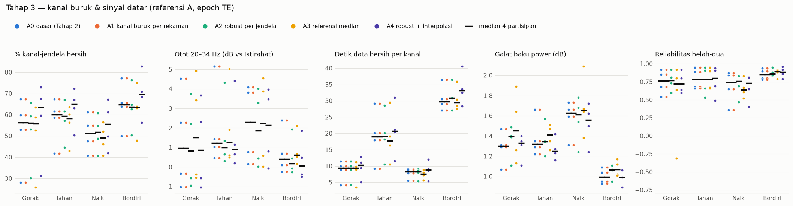

# Metode baru: EEG saat gerak berbasis timestamp manual

Analisis ini **berdiri sendiri** dan tidak memakai `eegpipe`. Analisis repo (`hasil_analisis/`, eegpipe v2 dengan
fase dari video/pose) hanya dipakai sebagai **pembanding**. Paket: `gerakeeg/`. Perintah:

```bash
.venv/bin/python analisis_baru/jalankan.py tahap1 P08 P09 P31 P32
.venv/bin/python -m pytest -q analisis_baru/tes
```

Masukan: `data/raw/PXX/PXX_Trial.EDF` dan `data/manual_timestamps/PXX_timestamps.csv`.

## Istilah
Setiap repetisi terdiri dari empat fase berurutan, ditambah dua segmen di luar repetisi.

| Fase | Label timestamp | Jendela observasi (detik EEG, offset 0) | Durasi fase |
|---|---|---|---|
| **Gerak**: Ngeed / Agem Kanan / Agem Kiri | `N` / `AKA` / `AKI` | Gerak − 0,5 … Tahan | Tahan − Gerak |
| **Tahan** | `T` | Tahan − 0,5 … Naik | Naik − Tahan |
| **Naik** | `N` (sesudah `T`) | Naik − 0,5 … Berdiri | Berdiri − Naik |
| **Berdiri** | `B` | Berdiri − 0,5 … Gerak berikutnya (maks. Berdiri + 8 dtk) | Gerak berikutnya − Berdiri |
| **Tutup Mata** | `TT` | TT − 0,5 … TT + 30 | 30 dtk |
| **Istirahat*** | (tidak ada) | Berdiri terakhir blok 1 + 8 … Gerak pertama blok 2 − 5 | ±170 dtk |

*Istirahat adalah turunan (jeda antar-blok, tanpa timestamp) dan hanya dipakai sebagai acuan.

- Setiap jendela dimulai 0,5 dtk sebelum timestamp onsetnya. Durasi fase tetap dihitung dari timestamp.
- Repetisi dinomori per gerakan menurut blok: blok 1 = rep 1–2, blok 2 = rep 3–4. P31 tidak punya Ngeed di
  blok 1, jadi Ngeed-nya rep 3–4.
- Buka mata (Romberg EO) tidak ditandai, sehingga belum dianalisis.
- Urutan label yang menyimpang dicatat di `hasil/tahap1_kualitas/masalah_timestamp.csv`. Pada keempat
  partisipan tidak ada.

## Rencana bertahap
| Tahap | Isi | Status |
|---|---|---|
| 1 | Inventaris kualitas sinyal per fase (tanpa mengubah data) | **Selesai** |
| – | Epoching: B / T / TE / E | **Selesai → TE dipakai** (keputusan pengguna 2026-09-25) |
| 2 | Referensi: A rata-rata per belahan · B rata-rata 16 kanal · C bipolar tetangga · D telinga A1/A2 (asli) | **Selesai → A dipakai** (keputusan pengguna) |
| 3 | Kanal buruk & sinyal datar: per rekaman · per jendela (robust) · referensi median · interpolasi | **Selesai → usul A2 robust** (menunggu persetujuan) |
| 4 | Lonjakan artefak gerak: A ASR (kalibrasi Istirahat) · B tolak per potongan, ambang per partisipan · C hanya ditandai | Menunggu |
| 5 | Mata & otot: A ICA + ICLabel · B BSS-CCA (otot) · C regresi kedipan Fp1/Fp2 | Menunggu |
| 6 | Aturan pakai jendela & uji sensitivitas | Menunggu |

Setiap tahap diukur ulang dengan inventaris Tahap 1. Tahap berikutnya dimulai setelah hasil disetujui.

---

## Tahap 1: kualitas sinyal per fase
Kode: `gerakeeg/kualitas.py`. Hasil: `hasil/tahap1_kualitas/`.

Sinyal EDF mentah dipakai untuk penanda **datar** (SD < 0,5 µV per 0,2 dtk; reset atau putus kanal KT88) dan
clipping. Sinyal bandpass 1–35 Hz, tanpa ICA dan tanpa interpolasi, dipakai untuk amplitudo dan spektrum.
Setiap jendela observasi dipotong per 1 dtk (geser 0,5 dtk). Tiap potongan × kanal diberi label:

- **ok**: ≤ 100 µV peak-to-peak
- **tinggi**: 100–150 µV
- **ekstrem**: > 150 µV
- **datar**: ≥ 10% sampel datar

### % potongan ok per fase
| Fase | P08 | P09 | P31 | P32 |
|---|---|---|---|---|
| Gerak (Ngeed/Agem) | 22 | 16 | 14 | 3 |
| Tahan | 42 | 22 | 22 | 9 |
| Naik | 23 | 16 | 12 | 10 |
| Berdiri | 44 | 27 | 26 | 15 |
| Tutup Mata | 58 | 78 | 68 | 64 |
| Istirahat* | 57 | 47 | 71 | 51 |

Rincian (`ringkasan_fase.csv`): % ekstrem saat Gerak 46–77, Tahan 19–70, Naik 42–66, Berdiri 27–56; % datar
12–33 di semua fase. Median peak-to-peak per potongan: Gerak 183–457 µV, Tutup Mata 41–71 µV. Tidak ada clipping.



### Temuan
1. **Fase gerak hampir tidak bisa dipakai tanpa koreksi.** Saat Gerak dan Naik hanya 3–23% potongan yang ok. Kalau
   aturan tolak konvensional dipakai (jendela utuh ≤ 150 µV dan tidak datar), yang lolos hanya 0–15% jendela ×
   kanal. Artefak perlu dikoreksi (Tahap 2–5), bukan hanya dibuang.
2. **Berdiri belum tenang.** Ok 15–44% dengan 27–56% ekstrem. Gerak belum selesai sesudah B, dan jendelanya
   dimulai 0,5 dtk sebelum B. Berdiri tidak cocok menjadi acuan diam; Istirahat lebih baik (ok 47–71%).
3. **Tutup Mata dan Istirahat relatif bersih** (ok 47–78%). Tutup Mata P09 hanya 14% terekam dan P08 47%, karena EDF
   berhenti sebelum 30 dtk.
4. **Agem lebih buruk daripada Ngeed** (`ringkasan_gerakan_fase.csv`). Ok saat Gerak: Ngeed 3–32%, Agem Kanan 2–16%,
   Agem Kiri 3–22%; saat Tahan: Ngeed 10–56%, Agem 5–46%. Mengangkat lengan kemungkinan menarik kabel elektroda.
5. **Artefak gerak mengikuti belahan kiri/kanan** (elektroda telinga A1/A2). Korelasi antar-kanal saat Gerak:

   | | dalam kiri (A1) | dalam kanan (A2) | antar belahan |
   |---|---|---|---|
   | P08 | 0,69 | 0,36 | −0,13 |
   | P09 | 0,69 | 0,46 | 0,13 |
   | P31 | 0,46 | 0,69 | 0,04 |
   | P32 | 0,51 | 0,54 | −0,02 |

   Belahan yang lebih buruk berbeda per orang. Pada peta kanal (`peta_kanal_pct_ok.png`) saat Gerak/Tahan/Naik:
   P31 belahan kanan 0–14% ok vs kiri 3–53%; P08 sebaliknya, kiri 6–57% vs kanan 21–57% (kiri lebih rendah di
   hampir semua kanal); P32 kedua belahan rendah (0–25%). Ini mendukung Tahap 2 (referensi) dikerjakan lebih dulu.
6. Power 1–4 Hz saat Gerak naik +5…+13 dB dan 20–34 Hz +3…+10 dB dibanding Istirahat → campuran artefak gerak
   lambat dan otot.



### Pembanding: analisis repo
Jendela analisis repo: fase dari video/pose, offset sinkronisasi repo (P08 0,95; P09 1,70; P31/P32 0,85 dtk),
batas dipangkas 0,25 dtk. Pemetaannya: TURUN ↔ Gerak, TAHAN ↔ Tahan, NAIK ↔ Naik. Repo tidak punya fase Berdiri.

| % ok | P08 repo / baru | P09 | P31 | P32 |
|---|---|---|---|---|
| Gerak | 16 / 22 | 13 / 16 | 13 / 14 | 3 / 3 |
| Tahan | 49 / 42 | 39 / 22 | 23 / 22 | 14 / 9 |
| Naik | 16 / 22 | 16 / 16 | 28 / 12 | 12 / 10 |

- Kualitas di kedua metode setara rendahnya. Perbedaan kualitas bukan alasan memilih salah satu.
- Jendela repo jauh lebih pendek. Median panjang Gerak 0,7–1,3 dtk (repo) vs 2,4–3,7 dtk (baru); Naik 0,5–2,8 vs
  2,1–3,2 dtk. Karena itu aturan "jendela utuh ≤ 150 µV" tampak lebih longgar di repo.
- **Onset Gerak manual 1,2–2,7 dtk lebih awal** daripada onset turun batang tubuh di repo (median per partisipan,
  dalam detik EEG; `pembanding_selisih_onset.csv`). Onset Tahan −0,8…0,0 dtk dan Berdiri −0,1…+0,8 dtk lebih dekat.
  Timestamp manual menandai awal gerak lebih dini, kemungkinan termasuk gerak lengan/persiapan yang tidak
  dianggap "turun" oleh pelacak pose.



### File
- `repetisi.csv`: onset dan durasi tiap fase per repetisi. `jendela_observasi.csv`: jendela per fase.
- `potongan_1dtk.csv`: label per potongan 1 dtk × kanal.
- `jendela_kanal.csv`: per jendela × kanal: % datar, peak-to-peak, layak_ketat, power 1–4 Hz dan 20–34 Hz (dB
  relatif Istirahat). Berisi juga baris `sumber = repo_video`.
- `jendela.csv`: per jendela: cakupan EDF dan korelasi antar-kanal dalam/antar belahan.
- `ringkasan_fase.csv` (baru + repo), `ringkasan_gerakan_fase.csv`, `ringkasan_kanal_pct_ok.csv`.
- `pembanding_repo_vs_baru.csv`, `pembanding_selisih_onset.csv`, `masalah_timestamp.csv`.

---

## Perbandingan epoching B vs E
Kode: `gerakeeg/epoch.py`. Perintah: `jalankan.py epoch`. Hasil: `hasil/epoch_banding/` (kini juga berisi T dan TE, lihat bagian berikut). Dinilai **sebelum koreksi
artefak**, dengan aturan bersih yang sama per kanal: datar < 10% dan peak-to-peak ≤ 150 µV.

- **B**: satu epoch tetap 1,5 dtk per fase, [onset − 0,5, onset + 1,0]. Fase lebih pendek dari 1 dtk tidak dipakai
  (2 dari 184 fase).
- **E**: jendela 1 dtk bergeser 0,25 dtk sepanjang rekaman. Jendela diberi label fase bila seluruhnya berada di
  dalam jendela observasi fase itu; jendela yang melintasi batas fase dibuang. Nilai per repetisi = rata-rata
  power jendela yang bersih.
- Power theta/mu/beta dalam dB relatif Istirahat, yang dipotong dengan cara yang sama. Unit independen tetap
  repetisi: jendela E yang tumpang tindih tidak dihitung sebagai sampel terpisah.

| Ukuran (rentang 4 partisipan) | Fase | B | E |
|---|---|---|---|
| Detik data bersih per kanal (median) | Gerak | 1,5–9 | 2,5–18 |
| | Tahan | 0–6 | 8,5–45 |
| | Naik | 1,5–6 | 3,8–10 |
| | Berdiri | 0–3 | 32–64 |
| Bagian jendela observasi yang terpakai | semua | 0,18–0,71 | 0,87–0,97 |
| Repetisi valid per kanal (median) | Tahan | 0–4 | 4–12 |
| % kanal dengan ≥ 3 repetisi valid | Gerak / Tahan | 0–88 / 0–81 | 38–100 / 81–100 |
| Galat baku power (dB, median) | Tahan | 1,5–2,0 (P32: tak terhitung) | 0,9–1,7 |
| Reliabilitas belah-dua pola kanal × pita | Gerak / Tahan | 0,45–0,69 / −0,29–0,71 | 0,65–0,94 / 0,57–0,97 |

- **E unggul di hampir semua ukuran.** E menghasilkan 2–10× lebih banyak data bersih dan memakai hampir seluruh
  fase (87–97%, B hanya 18–71%). E juga lebih presisi dan polanya lebih konsisten antar-repetisi. Pada P32 (sinyal
  paling buruk), B praktis tidak menghasilkan estimasi untuk Gerak, Tahan dan Berdiri; E masih menghasilkan.
- **Naik tetap lemah di kedua cara.** Datanya sedikit (3,8–10 dtk bersih) dan reliabilitasnya tidak stabil
  (−0,40…0,83). Fase ini paling pendek dan paling berartefak.
- **Kelemahan E yang perlu diingat:**
  1. E hanya memakai bagian fase yang bersih. Bila bagian bersih cenderung jatuh di sub-periode tertentu (mis. akhir
     Tahan yang lebih stabil), estimasinya mewakili "bagian tenang" fase itu, bukan seluruh fase.
  2. Aturan ≤ 150 µV diterapkan pada 1 dtk (E) vs 1,5 dtk (B), sehingga B sedikit lebih ketat.
  3. Resolusi frekuensi 1 Hz (jendela 1 dtk) cukup untuk mu/beta; theta 4–8 Hz hanya berisi 4 titik frekuensi.
- Perbandingan ini dibuat sebelum koreksi artefak dan perlu diulang sesudah Tahap 2–5. Bila koreksi berhasil,
  keunggulan jumlah data E akan mengecil, tetapi cakupan fase E tetap lebih besar.


---

## Bagian fase mana yang paling informatif: pra-onset, awal, tengah, akhir
Kode: `gerakeeg/posisi.py`. Perintah: `jalankan.py bagian`. Hasil: `hasil/bagian_fase/`.

Tiap fase dibagi menjadi pra-onset (0,5 dtk sebelum timestamp) dan tiga sepertiga sama panjang (awal, tengah,
akhir). Diukur sebelum koreksi artefak:

| Median 4 partisipan | Gerak pra / awal / tengah / akhir | Tahan | Naik | Berdiri |
|---|---|---|---|---|
| % potongan 0,5 dtk bersih | **63 / 49** / 28 / 29 | 31 / 40 / **51 / 54** | **51 / 42** / 29 / 23 | 23 / 33 / **55 / 67** |
| Otot 20–34 Hz (dB vs Istirahat) | **−0,1 / 2,2** / 6,4 / 6,9 | 6,7 / 4,7 / **2,0 / 1,9** | **2,2 / 3,6** / 7,8 / 8,5 | 8,7 / 5,2 / **1,9 / −0,2** |
| Delta 1–4 Hz (dB) | **1,8 / 7,7** / 15,0 / 13,9 | 12,1 / 10,7 / **4,4 / 3,7** | **4,1 / 5,4** / 10,6 / 17,1 | 15,6 / 12,8 / **5,3 / 0,9** |
| Mu C3/C4 (dB) | −0,8 / 0,2 / 2,4 / 0,1 | −0,5 / −0,4 / −1,1 / −0,7 | −1,3 / 0,6 / 1,7 / 0,7 | 0,1 / 0,6 / −0,1 / −0,8 |
| Beta C3/C4 (dB) | −1,1 / −0,8 / 0,8 / −0,2 | −1,3 / −1,2 / −0,5 / −1,1 | −1,6 / −1,2 / 0,1 / −0,3 | −0,1 / −0,4 / 0,2 / −0,7 |

(Pra-onset Tahan = akhir Gerak; pra-onset Naik = akhir Tahan; pra-onset Berdiri = akhir Naik.)

**Pola kualitas sangat konsisten di keempat partisipan** (`profil_bagian_fase.png`): kontaminasi otot dan gerak
lambat naik tajam begitu tubuh bergerak (tengah-akhir Gerak dan Naik), lalu turun lagi selama Tahan dan Berdiri.

| Fase | Bagian terbaik | Alasan |
|---|---|---|
| Gerak | **pra-onset + awal** | Paling bersih (63/49%). Otot ≈ 0–2 dB. Beta sensorimotor sudah turun (−1,1 dB) → ERD persiapan/inisiasi gerak. Tengah-akhir didominasi artefak (otot +6–7 dB, delta +14–15 dB). |
| Tahan | **tengah + akhir** | Awal masih membawa artefak dari Gerak (otot +4,7 dB). Tengah-akhir paling stabil (51–54% bersih, otot ≈ 2 dB); mu −1,1 dB dan beta −1,1 dB = ERD selama menahan. |
| Naik | **pra-onset + awal** | Sama dengan Gerak: inisiasi paling bersih (51/42%); sesudahnya artefak naik tajam. |
| Berdiri | **akhir** (dan tengah) | Awal masih penuh artefak dari Naik (otot +5–9 dB), jadi *beta rebound* sesudah gerak tidak dapat dinilai. Akhir hampir setara Istirahat (67% bersih, otot ≈ 0 dB). |

**Konsekuensi untuk metode E:** jendela bersih E tidak tersebar merata. Pada Gerak, 63% jendela bersih berasal dari
bagian awal, padahal bagian awal hanya 45% dari waktu. Pada Naik 65% vs 49%. Pada Berdiri 80% berasal dari tengah-
akhir. Jadi E diam-diam menjadi "awal Gerak", "awal Naik" dan "akhir Berdiri", dengan porsi yang berbeda per repetisi
dan per orang. Gambaran fasenya tidak lagi seragam.

**Batasan:** nilai mu/beta masih kecil dan belum konsisten antar-repetisi (|t| < 1,5). Arah per partisipan juga
bervariasi. P32 menunjukkan nilai sangat negatif karena acuan Istirahat-nya sendiri berartefak. Pola sinyal EEG
ini harus diuji ulang sesudah koreksi artefak; pola kualitasnya sudah jelas sekarang.



---

## Perbandingan epoching: B vs T (terarah) vs TE vs E
Kode: `gerakeeg/epoch.py`. Perintah: `jalankan.py epoch`. Hasil: `hasil/epoch_banding/`. Aturan bersih dan acuan
Istirahat sama untuk semua metode; sebelum koreksi artefak.

| Metode | Gerak | Tahan | Naik | Berdiri |
|---|---|---|---|---|
| **B** tetap 1,5 dtk | onset − 0,5 … + 1,0 | onset − 0,5 … + 1,0 | onset − 0,5 … + 1,0 | onset − 0,5 … + 1,0 |
| **T** terarah 1,5 dtk | = B (inisiasi) | 1,5 dtk di tengah fase | = B (inisiasi) | 2,0 … 0,5 dtk sebelum Gerak berikut |
| **TE** jendela geser 1 dtk di bagian informatif | onset − 0,5 … onset + maks(1; durasi/3) | tengah + akhir | seperti Gerak | tengah + akhir (sampai 0,5 dtk sebelum Gerak berikut) |
| **E** jendela geser 1 dtk | seluruh fase | seluruh fase | seluruh fase | seluruh fase |

Median 4 partisipan (`ringkasan_epoch.csv`):

| Ukuran | Fase | B | T | TE | E |
|---|---|---|---|---|---|
| % kanal-epoch bersih | Gerak | 25 | 25 | **36** | 26 |
| | Tahan | 19 | 35 | **42** | 37 |
| | Naik | 24 | 24 | **32** | 22 |
| | Berdiri | 10 | **51** | **51** | 40 |
| Otot 20–34 Hz (dB vs Istirahat) | Gerak | 3,4 | 3,4 | **1,7** | 4,8 |
| | Tahan | 7,0 | 2,7 | **2,1** | 3,0 |
| | Naik | 4,2 | 4,2 | **3,1** | 4,9 |
| | Berdiri | 8,7 | **0,5** | 1,1 | 2,3 |
| Detik data bersih per kanal | Gerak / Tahan / Naik / Berdiri | 3 / 2 / 4 / 2 | 3 / 6 / 4 / 10 | 6 / 14 / 5 / 25 | **12 / 23 / 8 / 39** |
| % kanal ≥ 3 repetisi bersih | Gerak / Tahan / Naik / Berdiri | 47 / 44 / 59 / 13 | 47 / 66 / 59 / 94 | 81 / **100** / 88 / **100** | 84 / **100** / **100** / **100** |
| Galat baku power (dB) | Gerak / Tahan / Naik / Berdiri | 1,7 / 1,5 / 1,4 / 1,5 | 1,7 / 1,6 / 1,4 / 1,3 | 1,8 / 1,5 / 1,5 / 1,1 | 1,4 / 1,2 / 1,6 / 1,0 |
| Reliabilitas belah-dua | Gerak / Tahan / Naik / Berdiri | 0,6 / 0,2 / 0,6 / 0,2 | 0,6 / 0,0 / 0,6 / 0,6 | **0,8** / 0,6 / 0,4 / 0,8 | **0,8** / **0,8** / 0,3 / **0,9** |

- **T** memperbaiki B dengan jelas pada fase yang bergeser: Tahan (otot 7,0 → 2,7 dB) dan Berdiri (8,7 → 0,5 dB; kanal
  bersih 10 → 51%). Tetapi hanya satu epoch 1,5 dtk per repetisi, sehingga datanya sedikit dan reliabilitas Tahan
  rendah (median 0,0).
- **TE paling bersih dan paling seragam** di hampir semua fase: kanal bersih tertinggi dan kontaminasi otot terendah
  pada Gerak, Tahan dan Naik. Datanya 1,4–2,5× lebih banyak dari T. Reliabilitasnya mendekati E (Gerak 0,8; Berdiri 0,8),
  kecuali Tahan (0,6 vs 0,8).
- **E** tetap menang pada jumlah data dan galat baku, tetapi kontaminasi ototnya lebih tinggi dan isinya mencampur
  bagian fase yang berbeda (lihat bagian sebelumnya).
- **Naik** tetap fase terlemah di semua metode (reliabilitas 0,3–0,6).
- Usulan: **TE sebagai epoching utama**, E dan T sebagai uji sensitivitas. Perbandingan diulang sesudah koreksi
  artefak (Tahap 2–5).



---

## Tahap 2: skema referensi (dinilai dengan epoch TE)
Kode: `gerakeeg/referensi.py`. Perintah: `jalankan.py tahap2`. Hasil: `hasil/tahap2_referensi/`.

Referensi diterapkan per jendela 1 dtk. Kanal yang datar di jendela itu tidak ikut membentuk referensi, sehingga
kanal yang sedang reset/putus tidak mencemari kanal lain. Acuan Istirahat dihitung dengan skema yang sama.

| Median 4 partisipan | Fase | D telinga (asli) | **A rata-rata belahan** | B rata-rata 16 | C bipolar |
|---|---|---|---|---|---|
| % kanal-jendela bersih | Gerak / Tahan / Naik / Berdiri | 36 / 42 / 32 / 51 | **56 / 60 / 51 / 65** | 34 / 44 / 35 / 56 | 37 / 42 / 33 / 49 |
| Otot 20–34 Hz (dB) | Gerak / Tahan / Naik / Berdiri | 1,7 / 2,1 / 3,1 / 1,1 | **1,0 / 1,2 / 2,3 / 0,4** | 2,3 / 2,7 / 3,4 / 1,1 | 1,4 / 1,7 / 2,6 / 0,8 |
| Detik bersih per kanal | Gerak / Tahan / Naik / Berdiri | 6 / 14 / 5 / 25 | **9 / 19 / 8 / 30** | 6 / 15 / 5 / 28 | 5 / 14 / 5 / 25 |
| Galat baku power (dB) | Gerak / Tahan / Naik / Berdiri | 1,8 / 1,5 / 1,5 / 1,1 | **1,3 / 1,3** / 1,6 / **1,0** | 1,4 / 1,4 / 1,8 / 1,0 | 1,6 / 1,4 / 1,6 / 1,0 |
| Reliabilitas belah-dua | Gerak / Tahan / Naik / Berdiri | 0,75 / 0,62 / 0,36 / 0,80 | **0,76 / 0,78 / 0,74 / 0,85** | 0,55 / 0,72 / 0,55 / 0,78 | 0,66 / 0,70 / −0,18 / 0,74 |
| Korelasi dalam belahan | semua fase | 0,51–0,64 | −0,15…−0,09 | 0,26–0,52 | −0,08…−0,02 |
| Korelasi antar belahan | semua fase | −0,10…0,02 | 0,00 | **−0,48…−0,42** | 0,01–0,02 |

- **A (rata-rata per belahan) unggul di semua ukuran data.** Persentase bersih naik +13…+21 poin. Kontaminasi otot
  turun. Reliabilitas Naik naik dari 0,36 ke 0,74, jadi Naik kini dapat dianalisis. Korelasi dalam belahan hilang:
  nilai sekitar −0,1 adalah nilai bawaan rata-rata referensi (≈ −1/7). Artefak bersama dari A1/A2 memang terhapus.
- **B (rata-rata 16 kanal) justru menyebarkan artefak.** Artefak A1 dikurangkan juga dari kanal kanan, sehingga muncul
  korelasi negatif antar belahan (−0,4…−0,5). Perolehan datanya kecil.
- **C (bipolar) menghapus artefak bersama**, tetapi kanal bersih tidak bertambah dan Naik menjadi tidak reliabel
  (−0,18). Selisih dua kanal yang sama-sama bising tetap bising.
- Keseimbangan belahan dengan A: kanal bersih saat Gerak kiri 69%, kanan 38% (D: 34% vs 19%). Belahan kanan tetap
  lebih buruk (`korelasi_belahan.csv`), yang merupakan sasaran Tahap 3–5.

**Konsekuensi A yang harus diingat saat menafsirkan:**
1. Aktivitas otak yang merata di satu belahan ikut terhapus. Yang tersisa adalah perbedaan antar-kanal di dalam
   belahan, sehingga ERD yang fokal (mis. C3 lebih kuat daripada kanal lain di kiri) tetap terlihat, sedangkan ERD
   yang merata di seluruh belahan tidak.
2. Indeks lateralisasi (C3 vs C4) kini membandingkan C3 relatif belahan kiri dengan C4 relatif belahan kanan, bukan
   potensial mentah. Nilainya tidak dapat dibandingkan langsung dengan analisis repo.
3. Kanal yang ≥ 10% datar tidak ikut membentuk referensi. Bila kurang dari 2 kanal tidak-datar dalam satu belahan,
   seluruh belahan dianggap hilang di jendela itu.

**Uji Berger tidak informatif.** Alpha oksipital relatif saat Tutup Mata TIDAK lebih tinggi daripada Istirahat di
skema mana pun, termasuk telinga asli (−1,8…−0,02 dB). Masalahnya ada di data, bukan di referensi. Kemungkinannya:
(a) alpha memang lemah pada rekaman ini, sesuai catatan repo sebelumnya (tidak ada puncak alpha jelas); (b) kondisi
mata saat Istirahat tidak diketahui, bisa saja sebagian partisipan menutup mata; (c) P09 hanya 7 jendela Tutup Mata.
Perlu konfirmasi ke pengguna: apakah mata terbuka saat Istirahat utama?



---

## Tahap 3: kanal buruk & sinyal datar (referensi A, epoch TE)
Kode: `gerakeeg/kanal.py`. Perintah: `jalankan.py tahap3`. Hasil: `hasil/tahap3_kanal/`.

| Varian | Isi |
|---|---|
| A0 dasar | Referensi A apa adanya (Tahap 2) |
| A1 per rekaman | Kanal dengan z robust log-SD saat Istirahat > 3, atau datar > 50% rekaman, dibuang dari seluruh rekaman |
| A2 robust per jendela | Di tiap jendela, kanal pencilan (z robust log-ptp > 3 DAN > 2× median belahan) dikeluarkan dari referensi belahan dan ditandai hilang; iteratif |
| A3 referensi median | Referensi = median kanal belahan (kebal pencilan tanpa membuang kanal) |
| A4 robust + interpolasi | A2, lalu kanal yang hilang diisi spline sferis dari kanal belahan yang sama (bila ≥ 5 dari 8 baik) |

**Dari mana data hilang** (`nasib_kanal_jendela.csv`, % kanal-jendela TE):

| | P08 | P09 | P31 | P32 |
|---|---|---|---|---|
| Datar di EDF mentah (reset/putus kanal) | 25,3 | 23,2 | 17,5 | 24,1 |
| Dikeluarkan sebagai pencilan (A2) | 1,7 | 4,7 | 3,5 | 3,9 |
| Diisi interpolasi (A4) | 6,4 | 7,4 | 8,1 | 9,8 |

Kehilangan terbesar adalah **sinyal datar**, dan ini tidak dapat dipulihkan. 69% waktu datar berasal dari rentang
≥ 3 dtk, dan pada 14–22% waktu ada ≥ 6 kanal datar bersamaan. Tidak ada kanal yang buruk sepanjang rekaman (z
maksimum 1,05–1,68), sehingga A1 identik dengan A0.

**Median 4 partisipan, Gerak / Tahan / Naik / Berdiri:**

| | A0 dasar | A1 rekaman | **A2 robust** | A3 median | A4 robust + interp |
|---|---|---|---|---|---|
| % kanal-jendela bersih | 56 / 60 / 51 / 65 | = A0 | 56 / 59 / 52 / 64 | 56 / 58 / 49 / 64 | 64 / 65 / 56 / 70* |
| Otot 20–34 Hz (dB) | 0,97 / 1,23 / 2,30 / 0,40 | = A0 | **0,82 / 1,00 / 1,86 / 0,18** | 1,52 / 1,26 / 2,23 / 0,62 | 0,87 / 0,90 / 2,14 / 0,05 |
| Galat baku (dB) | 1,30 / 1,32 / 1,62 / 1,00 | = A0 | 1,40 / 1,35 / 1,61 / 1,06 | 1,45 / 1,41 / 1,65 / 1,07 | 1,33 / 1,25 / 1,56 / 0,99 |
| Reliabilitas belah-dua | 0,76 / 0,78 / 0,74 / 0,85 | = A0 | 0,77 / 0,78 / 0,76 / 0,86 | 0,72 / 0,78 / 0,64 / 0,90 | 0,72 / 0,80 / 0,73 / 0,89 |

\* A4 menghitung kanal hasil interpolasi sebagai data; isinya turunan kanal tetangga, bukan informasi baru.

- **Perbedaan antar-varian kecil.** Referensi A sudah menangani sebagian besar masalah di Tahap 2.
- **A2 robust** menurunkan kontaminasi otot di semua fase (−0,15…−0,45 dB) dengan biaya 2–5% kanal-jendela.
  Reliabilitas tetap atau sedikit naik. Manfaat utamanya: satu kanal yang meledak tidak lagi mencemari 7 kanal lain
  di belahannya lewat rata-rata referensi.
- **A3 median** lebih buruk (otot Gerak naik, reliabilitas Naik 0,64).
- **A4 interpolasi** tampak menambah data, tetapi hanya mengisi kanal kosong dengan tiruan tetangganya. Reliabilitas
  Gerak justru turun (0,72). Cocok hanya untuk analisis yang butuh montase lengkap (mis. topografi), dengan penanda.
- Catatan: algoritme A2 sempat mengeluarkan kanal normal secara berlebihan (MAD sangat kecil setelah pencilan
  pertama dibuang). Ini ditemukan lewat uji sintetis dan diperbaiki dengan syarat tambahan "> 2× median".

**Usul: A2 robust sebagai baku**, A4 hanya untuk topografi (ditandai).


